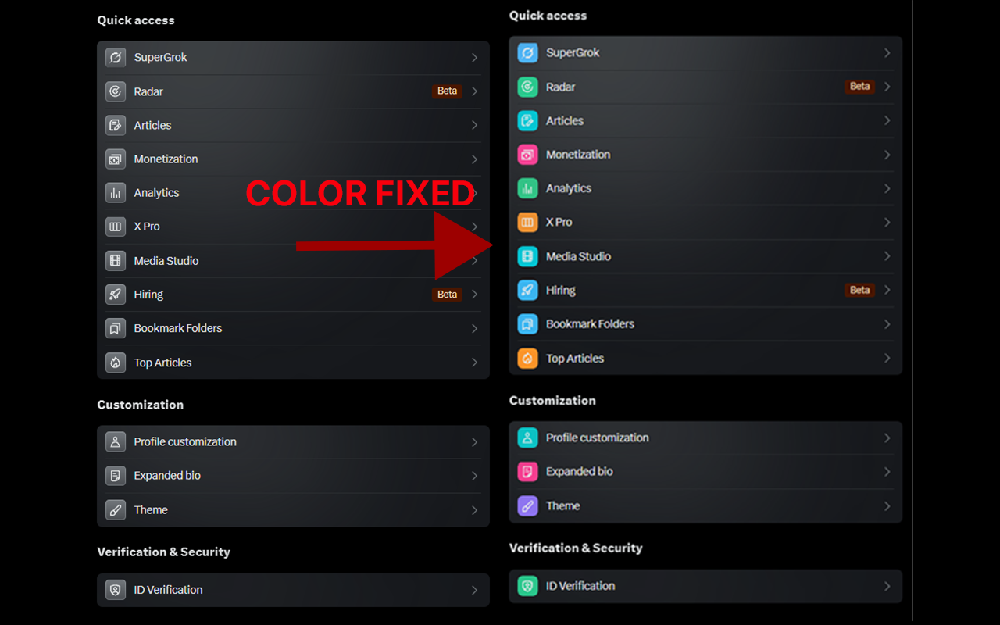

# X Premium Color Fixer

> A simple browser extension to restore the original colors to the X.com (formerly Twitter) Premium features panel.

## The Problem

Recently, X.com updated its UI for Premium subscribers, changing the colorful, distinct icons for features like "SuperGrok", "Analytics", and "Monetization" to a uniform, monochrome grey. This change makes it harder to quickly identify and navigate to the desired feature. The new design applies multiple CSS background gradients on top of each other, which overrides any simple attempts to restore the original background colors.

## The Solution

This extension solves the problem with a targeted and robust approach:

1.  **Activates Only on the Premium Page**: The extension's logic runs exclusively on the `/i/premium` URL, ensuring it doesn't interfere with any other part of X.com.
2.  **Scopes to Main Content**: It specifically targets the main content area (`[role="main"]`) to avoid accidentally modifying elements in the sidebar or other regions.
3.  **Removes Conflicting Styles**: It uses `background-image: none !important;` to strip away all of the conflicting gradient layers that X.com applies, allowing the true background colors to show through.
4.  **Restores Colors**: Using CSS variables for maintainability, the extension applies the original, vibrant color to each specific icon, making the panel scannable and visually distinct again.

## Installation from GitHub

Since this extension is not on the Chrome Web Store, you can easily install it directly from the source code.

1.  **Download the Code**: Click the green `<> Code` button on this GitHub page and select **Download ZIP**.
2.  **Unzip the File**: Extract the contents of the ZIP file to a permanent folder on your computer (e.g., `C:\Users\YourUser\Documents\Extensions\xPremiumColorFix`).
3.  **Open Chrome Extensions**: Open your Chrome or Chromium-based browser (like Edge, Brave, or Vivaldi) and navigate to `chrome://extensions`.
4.  **Enable Developer Mode**: In the top-right corner of the extensions page, turn on the "Developer mode" toggle switch.
5.  **Load the Extension**: Click the **Load unpacked** button that appears.
6.  **Select the Folder**: In the file selection dialog, navigate to and select the folder where you unzipped the files (the one containing `manifest.json`).
7.  **Done!**: The "X Color Fixer" extension will now appear in your list. Navigate to the [X Premium page](https://x.com/i/premium) to see the colors restored. 